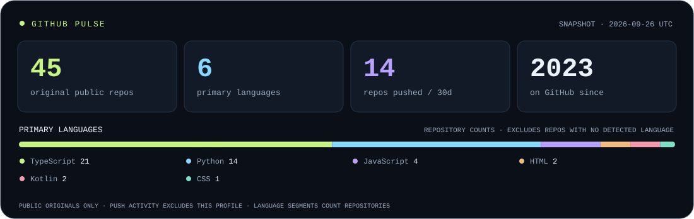

<picture>
  <source media="(max-width: 600px)" srcset="./assets/hero-mobile.svg">
  
</picture>

<p align="center">
  <a href="#selected-builds">Explore the builds</a> &nbsp; / &nbsp;
  <a href="#choose-your-path">Choose your path</a> &nbsp; / &nbsp;
  <a href="#github-pulse">GitHub pulse</a> &nbsp; / &nbsp;
  <a href="#bonus-level">Bonus level</a>
</p>

I'm **Srishanth Goud**. I build AI tools, full-stack web apps, and the occasional Android side quest. My repositories range from local language-model workflows to self-hosted CRMs, streaming apps, and websites with a little personality.

**Explore the code, try a demo, or take a side quest below.**

## Selected builds

Four doors into what I build. Pick one and explore the code.

<p align="center">
  <a href="https://github.com/iamsrishanth/OpenTeleCRM"></a>
  <a href="https://github.com/iamsrishanth/meta-ads-mcp"></a>
  <br>
  <a href="https://github.com/iamsrishanth/DriveTV"></a>
  <a href="https://github.com/iamsrishanth/LaSabrosov3"></a>
</p>

## Choose your path

Prefer a test drive? **[Visit La Sabroso ↗](https://lasabrosov3.vercel.app)** · **[Try CAT Prep Coach ↗](https://cat-prep-coach.vercel.app)**

<details>
<summary><b>01 &nbsp; I came for AI and automation</b></summary>

- **[Text-to-SQL Agent](https://github.com/iamsrishanth/text-to-sql-agent)** — ask a database questions in plain English, with LangGraph, Ollama, and SQLite.
- **[Meta Ads MCP](https://github.com/iamsrishanth/meta-ads-mcp)** — give an AI client tools for campaigns, targeting, and advertising insights.
- **[Two-Way Sign Language Translator](https://github.com/iamsrishanth/two-way-sign-language-translator)** — an experiment connecting ASL fingerspelling, text, and speech.

</details>

<details>
<summary><b>02 &nbsp; Show me products and interfaces</b></summary>

- **[OpenTeleCRM](https://github.com/iamsrishanth/OpenTeleCRM)** — leads, calls, WhatsApp, and automation in a self-hosted sales workspace.
- **[CAT Prep Coach](https://github.com/iamsrishanth/cat-prep-coach)** — a PWA for study tracking, mock analysis, and building consistent habits.
- **[La Sabroso](https://github.com/iamsrishanth/LaSabrosov3)** — a cafe website built on Next.js.
- **[DriveTV](https://github.com/iamsrishanth/DriveTV)** — a Kotlin and Compose app that brings Google Drive video to Android TV.

</details>

<details>
<summary><b>03 &nbsp; Open the toolbox</b></summary>

Technologies used across these projects. Follow a language to browse the matching repositories.

| Layer | Tools in the repos |
| :--- | :--- |
| Languages | [TypeScript](https://github.com/iamsrishanth?tab=repositories&language=typescript) · [Python](https://github.com/iamsrishanth?tab=repositories&language=python) · [JavaScript](https://github.com/iamsrishanth?tab=repositories&language=javascript) · [Kotlin](https://github.com/iamsrishanth?tab=repositories&language=kotlin) |
| Web | React · Next.js · Tailwind CSS · Vite |
| Backend & data | NestJS · FastAPI · PostgreSQL · SQLite |
| AI & automation | MCP · LangGraph · Ollama |
| Android | Jetpack Compose · Media3 |

</details>

## GitHub pulse

<a href="https://github.com/iamsrishanth?tab=repositories">
  <picture>
    <source media="(max-width: 600px)" srcset="./assets/github-pulse-mobile.svg">
    
  </picture>
</a>

<details>
<summary><b>Open the activity log</b></summary>

<!-- ACTIVITY:START -->

**42** original public repos · **6** primary languages · **10** repos pushed / 30 days · Account created **2023**

Primary languages by repository count: TypeScript **19** · Python **14** · JavaScript **4** · HTML **2** · CSS **1** · Kotlin **1**

| Recently pushed | Primary language | Last push (UTC) |
| :--- | :--- | :--- |
| [Papilio](https://github.com/iamsrishanth/Papilio) | TypeScript | 2026-09-09 |
| [Sackhe](https://github.com/iamsrishanth/Sackhe) | HTML | 2026-09-08 |
| [RoosterX](https://github.com/iamsrishanth/RoosterX) | TypeScript | 2026-09-07 |
| [Lavish&#95;looks](https://github.com/iamsrishanth/Lavish_looks) | TypeScript | 2026-09-07 |

<sub>Snapshot: 2026-09-11 UTC. Metrics count original public repositories, including archived projects and this profile; 30-day pushes exclude this profile. Language counts omit repos with no detected primary language. The table excludes forks, archived projects and this profile. Pushes can include collaborator or automated updates.</sub>

<!-- ACTIVITY:END -->

</details>

## Bonus level

<details>
<summary><b>Unlock a tiny JavaScript side quest</b> &nbsp; <code>+1 curiosity</code></summary>

Predict the three outputs before opening the answer:

```js
console.log(Boolean([]));
console.log(Number([]));
console.log(String([]));
```

<details>
<summary>Reveal the loot</summary>

```js
true
0
""
```

An array is an object, so it's truthy. Converting an empty array to a number gives `0`; converting it to a string gives an empty string. The last line above represents that empty output as `""`.

**Achievement unlocked: never trust a value by its brackets.**

</details>
</details>

---

<p align="center">
  Have an idea worth building? <a href="https://github.com/iamsrishanth/iamsrishanth/issues/new?template=say-hello.yml"><b>Say hello →</b></a><br>
  <sub>Or find your next rabbit hole in <a href="https://github.com/iamsrishanth?tab=repositories">all my repositories</a>.</sub>
</p>



<p align="center"><sub><a href="./docs/PROFILE.md">About this profile</a></sub></p>
